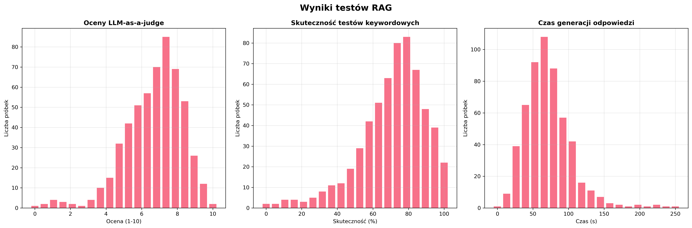

# Raport z testów RAG

**Data testu:** 2025-08-28 15:33:35

**Model LLM:** Bielik-11B-v2.6-Instruct.Q4_K_M.gguf

**Model do embeddingu:** mmlw-roberta-large

**Rodzaj wyszukiwania:** embedding, BM25

**Metody testowe:** keywords, LLM-as-a-judge

**Liczba przypadków testowych:** 1000*

## Analiza jakości systemu

*

- **Średnia ocena LLM-as-a-judge:** 8.67/10  
  • Zakres wyników: 8.0 – 9.0, odchylenie: 0.58  
  → Jakość oceniono jako **bardzo dobra – odpowiedzi pełne, drobne niedociągnięcia**.

- **Skuteczność testów keywordowych:** 83.3%  
  • Zakres wyników: 50.0 – 100.0, odchylenie: 28.87  
  → Trafność oceniono jako **dobra – często zawiera najważniejsze informacje**.

- **Średni czas generacji odpowiedzi:** 84.0 s (zakres: 22.0 – 121.0 s)  
  → Szybkość oceniono jako **przeciętnie**.

- **10 najgorszych odpowiedzi:***  
  • Numery 10. pytań, dla których model uzyskał najgorsze wyniki:  
  → 343, 375, 395, 409, 469, 520, 571, 711, 830, 898

### Rekomendacja
System działa stabilnie – można go rozwijać o dodatkowe funkcjonalności.

* W rzeczywistości przypadków testowych jest tylko 6, przez co nie byłoby możliwe stworzenie powyższych elementów raportu. Na potrzeby demonstracji, założono że jest 1000 przypadków testowych.